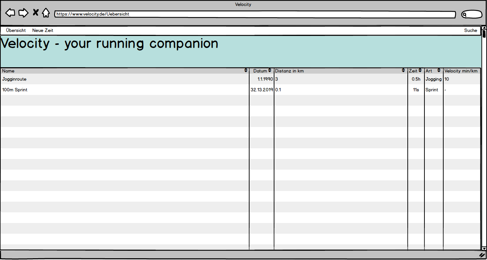
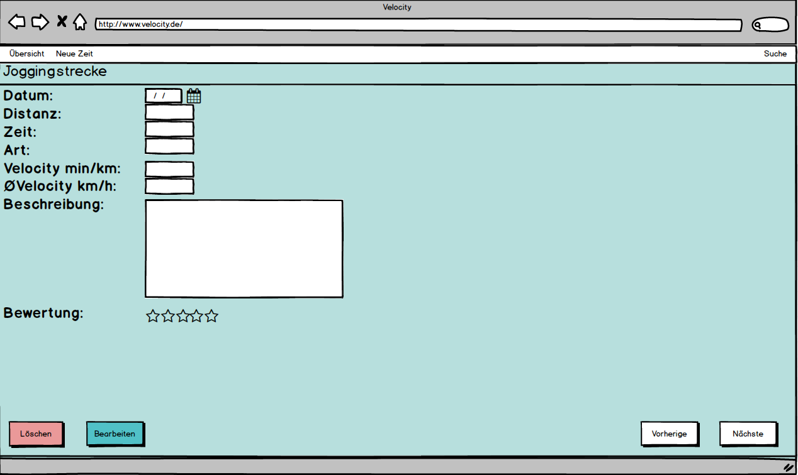
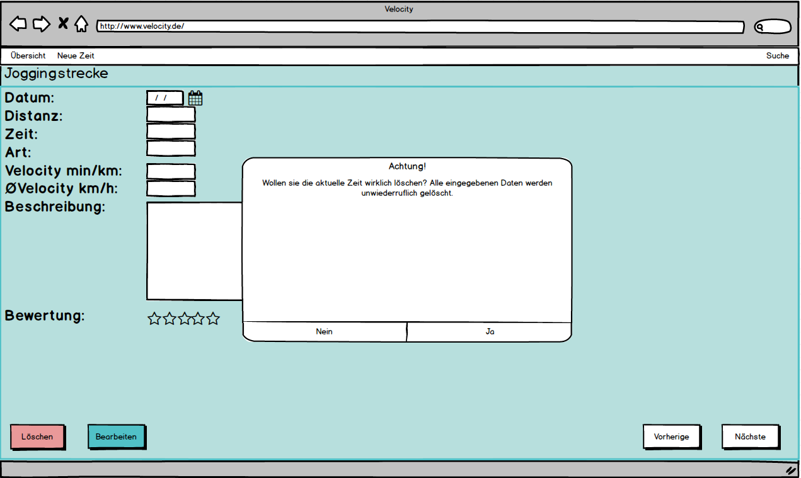

Beispielanwendung "My Songbook"
===============================

Kurzbeschreibung
----------------

Dies ist ein Beispiel für eine Browser App, die ohne einen Server
im Hintergrund komplett im Browser läuft. Es handelt sich dabei
um eine so genannte Single Page App, da die App nur einmal durch
Aufrufen der HTML-Datei gestartet und dann bis zum Verlassen der
App nicht wieder neugeladen wird.

Die Anwendung kann an folgender Stelle online betrachtet werden:
https://www.wpvs.de/my-songbook/

Verwendete Technologien
-----------------------

Die App nutzt den Node Package Manager npm als Paketverwaltung. Auf diese
Weise werden der Application Bundler ParcelJS sowie eine Hand voll externe
Bibliotheken für die Anwendung installiert. Jedoch wird kein übergreifendes
Framework wie Angular oder React verwendet, da diese für eine allgemeine
Einführung zu speziell sind und viele wesentliche Details verbergen.

Folgende Entwicklungswerkzeuge kommen stattdessen zum Einsatz:

 * [Atom:](https://atom.io/) Spezieller Texteditor für Webentwickler und Programmierer
 * [git:](https://git-scm.com/") Versionsverwaltung zur gemeinsamen Arbeit am Quellcode
 * [npm:](https://nodejs.org/") Paketverwaltung zum automatischen Download abhängiger Bibliotheken
 * [Parcel:](https://parceljs.org/") Web Application Bundler und Entwicklungsserver

Zusätzlich werden folgende Bibliotheken genutzt:

 * [Navigo:](https://github.com/krasimir/navigo) Single Page Router zur Vereinfachung der Navigation innerhalb der App
 * [PouchDB:](https://pouchdb.com/") Clientseitige NoSQL-Datenbank zum Speichern der Songtexte
 * [lyric-get:](https://github.com/rhnvrm/lyric-api") Kleine Bibliothek zur Suche von Songtexten im Internet
 * [Quill:](https://quilljs.com/") WYSIWYG-Editor zum Nachbearbeiten der Songtexte

UI-Skizzen und Screenshots
--------------------------

Die App richtet sich an Musiker, die anhand eines Lead Sheets neue Lieder
üben oder diese auf der Bühne vortragen wollen. Hierfür bietet sie eine
einfache Verwaltung von Songtexten mit der Möglichkeit, neue Texte online
zu suchen und der eigenen Sammlung hinzuzufügen.

<table style="max-width: 100%;">
    <tr>
        <td>
            
        </td>
        <td>
            
        </td>
        <td>
            
        </td>
    </tr>
    <tr>
        <td>
            Mobile Darstellung
        </td>
        <td>
            Übersicht der Songtexte
        </td>
        <td>
            Anzeige eines Songtexts
        </td>
    </tr>
</table>

Copyright
---------

Dieses Projekt ist lizenziert unter
[_Creative Commons Namensnennung 4.0 International_](http://creativecommons.org/licenses/by/4.0/)

© 2018 Dennis Schulmeister-Zimolong  

E-Mail: [dhbw@windows3.de](mailto:dhbw@windows3.de)  
Webseite: https://www.wpvs.de
